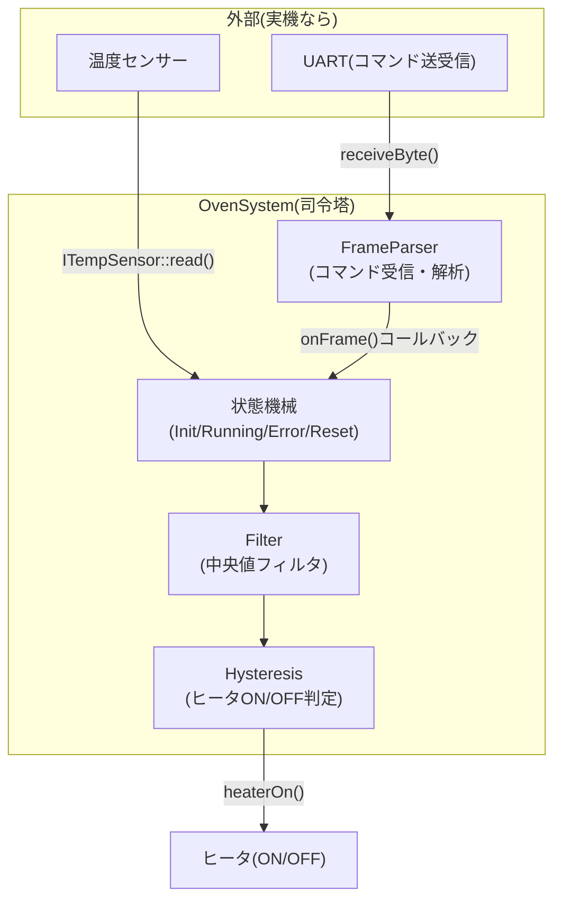
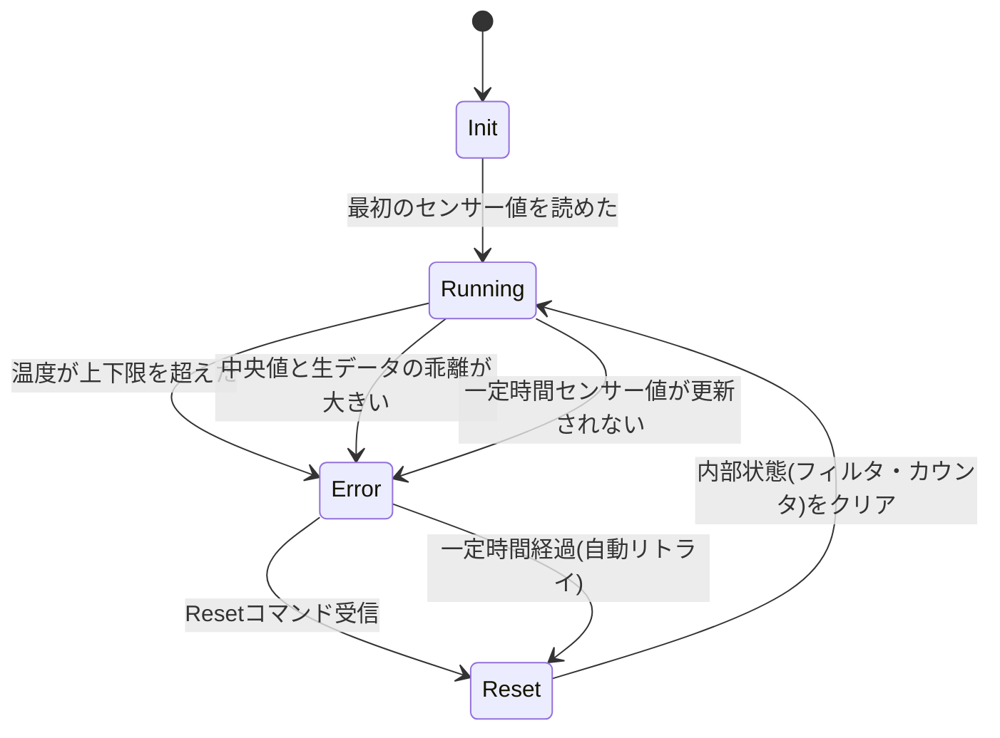

# 環境制御コントローラ シミュレータ

温室の環境制御装置を模した、組込み制御ソフトウェアのシミュレータです。実機の温度センサー・UART通信をソフトウェアインターフェースの背後に隠すことで、ロジック全体をPC上でテストできる構成(ホストベーステスト)にしています。

## 構成図



`ITempSensor`はインターフェース(抽象クラス)で、実機では`RealTempSensor`(ADCレジスタを読む実装)、テストでは`FakeTempSensor`(任意の値を注入できる実装)を差し替えて使う。これによりハードウェアなしでロジックを検証できる。

## 状態遷移図



## 通信コマンド仕様

Week2で作成したフレームプロトコル(`SOF(0xAA) LEN PAYLOAD... CHECKSUM`)を使用。`PAYLOAD[0]`をコマンドIDとする。

| コマンドID | 名称 | ペイロード | 動作 |
|---|---|---|---|
| `0x01` | 目標温度設定 | コマンドID(1B) + 温度×10(2B, ビッグエンディアン) | `target_`を更新 |
| `0x02` | 現在値取得 | コマンドID(1B)のみ | 現在のフィルタ後温度を`lastQueriedCurrent()`で取得可能にする |
| `0x03` | 状態取得 | コマンドID(1B)のみ | 現在の状態を`lastQueriedStatus()`で取得可能にする |

温度は小数点第1位まで表現するため「×10した整数」として2バイトで送る(浮動小数点をそのままバイト列に乗せない、という組込みで一般的な取り決め)。

## tickスケジューリング

`tick(now_ms)`を1msごとに呼び出す想定。内部で3つの周期を管理する。

- 10ms: 制御周期(センサー読み取り→フィルタ→状態機械→ヒータ判定)
- 1000ms: ログ出力

いずれも「前回実行時刻からの経過時間」を`now_ms`と比較する形で、複数の周期を1つの`tick`関数の中で管理している。

## テスト

`week3/day6/`のGoogleTestスイート(27件): `Filter`(4)・`Hysteresis`(4)・`FrameParser`(4)・`OvenSystem`統合テスト(15)。ハード依存部分(`ITempSensor`)を`FakeTempSensor`に差し替えることで、実機なしで状態遷移・異常検知・コマンド処理をすべて検証している。

```bash
cmake -B build
cmake --build build
ctest --test-dir build --output-on-failure
```

## FPGA経験がどこに活きたか

4年間のFPGA(HDL)設計経験は、このプロジェクトの随所で直接活きている。状態機械の設計(`Init`→`Running`→`Error`→`Reset`)は、HDLで書いてきたステートマシンとほぼ同じ発想で、`switch`文による状態遷移の書き方もHDLの`case`文の感覚に近い。`UartRegs`のようなメモリマップドレジスタ構造や、ビット操作(コマンドのビッグエンディアン組み立てなど)も、レジスタ仕様書を作る側にいた経験がそのまま活きる部分だった。

また、`ITempSensor`インターフェースを介して実機とテスト用の偽実装を差し替える設計は、HDLのテストベンチで「実際のハードウェアの代わりに、期待する入力パターンを注入して振る舞いを検証する」のとまったく同じ考え方であり、境界値・網羅性を意識したテスト設計は、FPGA検証で培った視点がソフトウェアテストにもそのまま応用できることを実感した。
